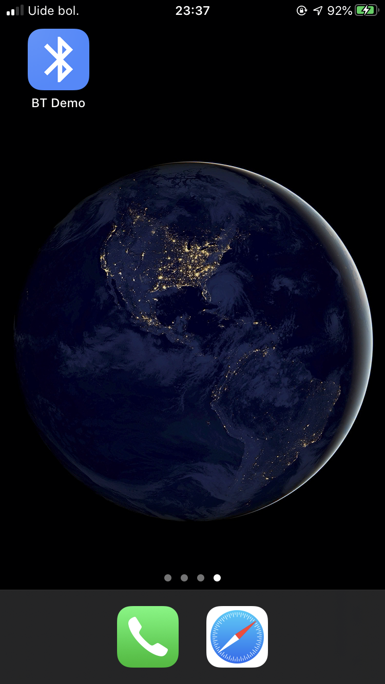
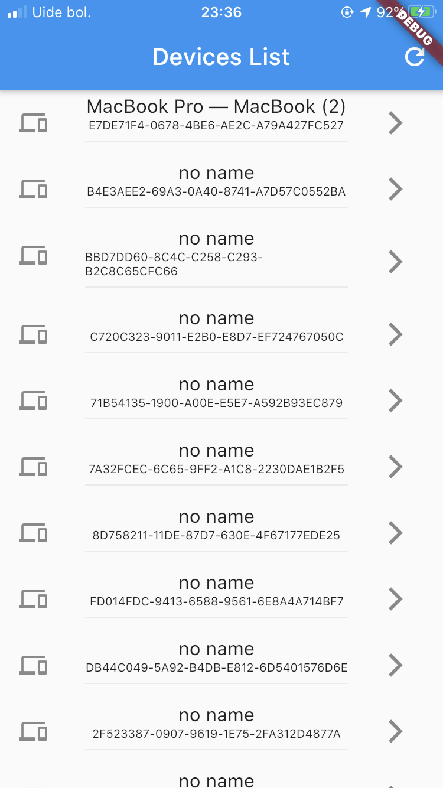
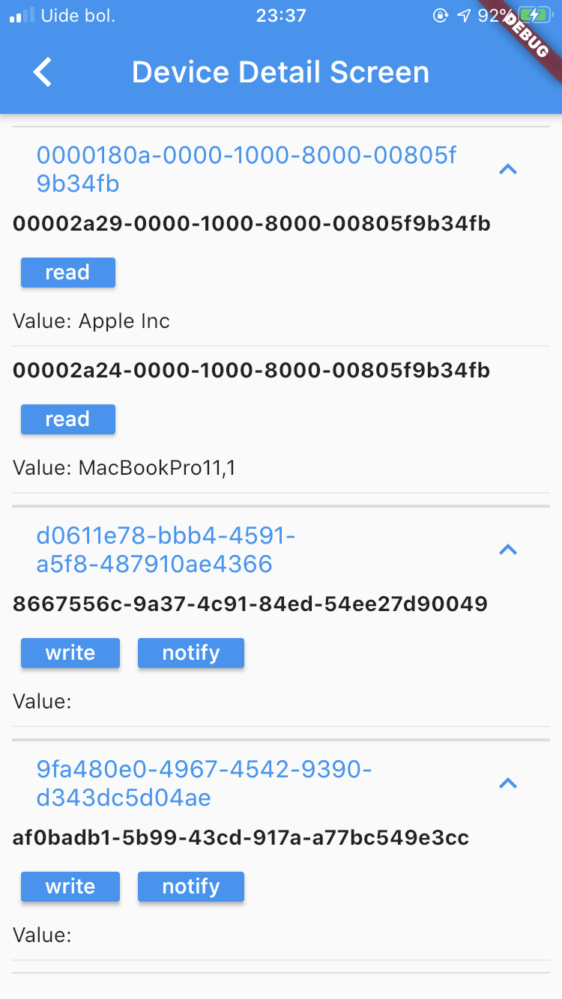

# Bluetooth Demo

This simple application was done to see possibilities of connecting phone and bluetooth devices via flutter

You can subscribe to notifications from device or read from it, did not implement write option due to high volatility of tested device

## Acknowledgements

Thanks to [this](https://blog.kuzzle.io/communicate-through-ble-using-flutter) tutorial

## Screenshots

  
  
  
  

